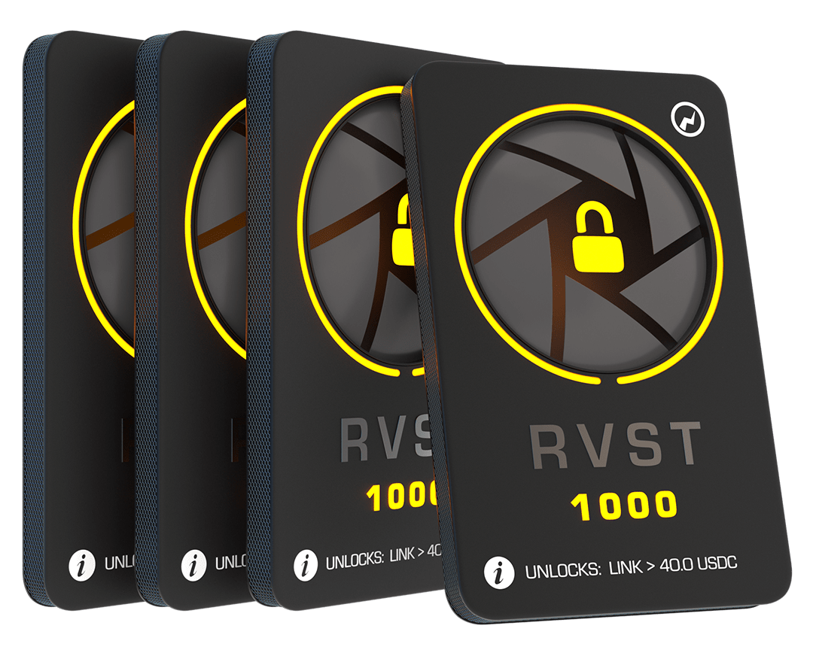
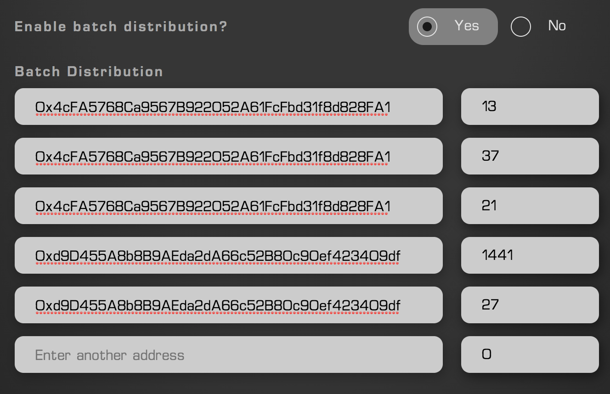

Batch distribution allows for the designation of multiple recipients for the FNFT config being created. Once batch distribution has been enabled, the quantity of FNFTs being created becomes set to the amount of FNFTs per address summed together. By this method, effective batch distribution of vesting schedules may be carried out. 

To access Batch Distribution, simply open the Advanced Settings and enable Batch Distribution.

    

## Support for CSV/Spreadsheets

To streamline User-Experience, CSV's and Excel Spreadsheets consisting of | address | number pairs may be pasted into the batch distribution system to allow ease of use. Any decimals will be rounded up or down to whole integers.

    

How the batch distribution menu appears
