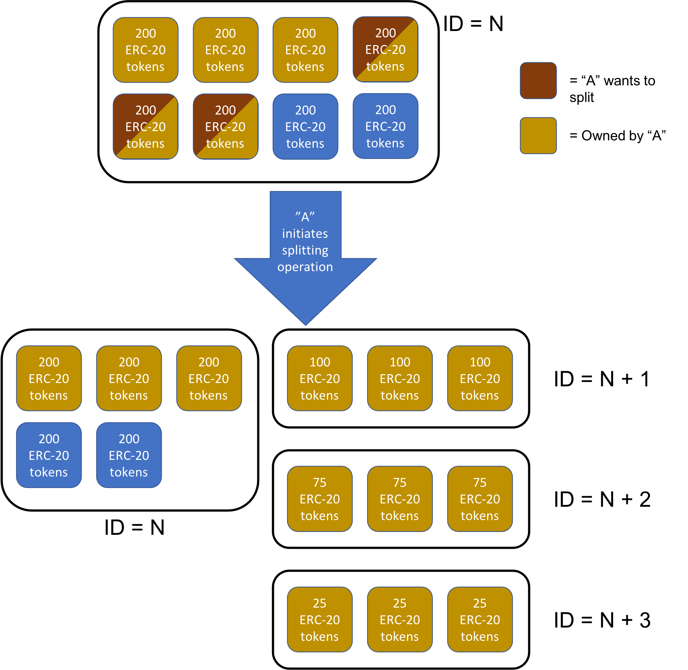

> The graphic explains it better than words ever could

Splitting is an operation by which any number of FNFTs within a series may be split along the ERC20 denominations contained therein into however many sub-series are desired by their owner. For this process, the owner of the FNFT in question must:

- Own at least as any FNFTs as he or she desires to split
- Have the sum of the desired splits equal 100% of the value in the FNFT

The splitting operation is not well explained in words and is detailed below in the following diagram, where N is the FNFT ID of the original series, and all sequential N's (N+1, N+2, etc.) are IDs created in the splitting process, based on the next available FNFT ID numbers. In this example, all FNFTs in Series N have 200 ERC-20 tokens enclosed within; owner A chooses to split 3 of his 6 FNFTs into 3 different components of 100, 75, and 25 ERC-20 tokens each. This results in the FNFT Series N+1, N+2, and N+3 being created. All FNFTs reference the original lock. 

    

