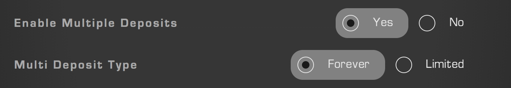
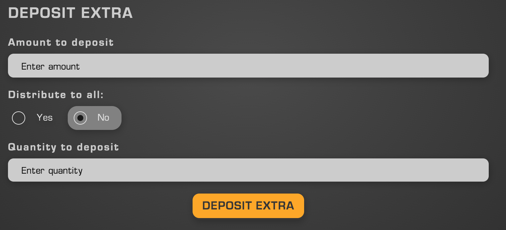

> How to top up your FNFTs

## Creation

Multiple deposit operations are those by which an FNFT owner may increase the amount of tokens stored within their FNFT. Multiple deposits are enabled during the creation process from the "Advanced" menu, as detailed in Figure 1.

    

> Figure 1: Multiple Deposits Config

As Figure 1 details, there are two types of multiple deposits:

- Forever: This option will allow additional deposits to be made to the FNFT forever. More details on who can make these deposits will be provided further on, but this is the best option to select if you just want to have the ability to continue to top-up your FNFTs over time
- Limited: Allows the minter to set a date after which no further additional deposits will be accepted. Useful for time-sensitive events, such as a charity raises or crowdfunding events. 

## Making an Additional Deposit

    

> Figure 2: Not all options will always be visible

The UI to find the additional deposit interface may be found within the Info Panel, accessible by clicking on an FNFT within the gallery. This UI will only appear for valid FNFTs that have this option enabled. Additional deposits may only be made in the ERC20 that is already contained within the existing FNFT.

- Amount to deposit: The amount of ERC20s to deposit into X number of FNFTs. If you are depositing Y amount to X FNFT's within the series, it will cost you X*Y ERC20's
  - Example: You deposit 50 ERC20's per FNFT to a series of 100 FNFTs. This costs 5000 ERC20s
- Distribute to all: Selecting "Yes" will distribute the ERC20s you are depositing across the entire supply of the series. Anyone may perform this operation, even those who do not own FNFTs within the selected series. Selecting "No" will display the "Quantity to deposit" field
  - Depositing to all within a series will not create a new FNFT series and is thus a cheaper operation to perform
- Quantity to deposit: The amount of X FNFTs you would like to deposit to. This number cannot exceed the number of FNFTs you personally own. The result of this operation will be the creation of a new FNFT series.

## Suggested Applications
Multiple-deposit FNFTs are ideal for situations in which a group of people want to raise money, particularly when that raise has a time-based goal. The FNFTs of the series remain locked throughout additional deposits. Some suggested applications are as follows:

- On-chain crypto raises with automatic distribution along individually fractionalized lines
- Charity events
- Endowments
- Funds
