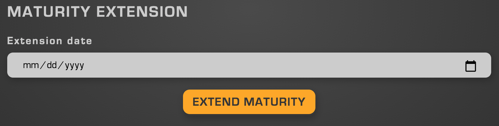

## Creation

    

Extendable maturity may be enabled in the advanced features menu via the "Advanced Settings" tab and is only available for Time Locks. 

## Extending Maturity Dates

    

From the Info Panel, maturities of FNFTs may be extended. This is only available if the user in question owns the entire supply of FNFTs. This is useful for cases in which a team wishes to extend their liquidity lock, while retaining ownership of the entire supply of LP tokens. 
