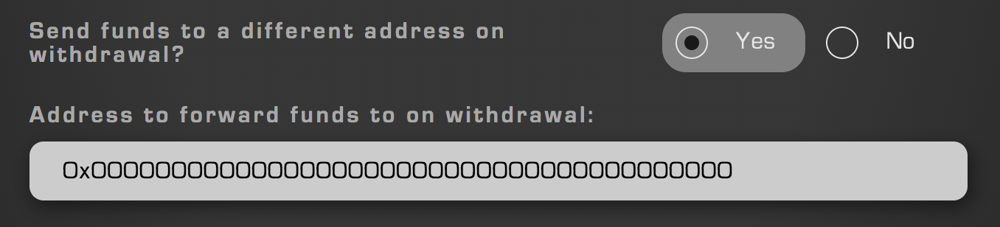

## Purpose
Directed output exists as a feature that when enabled will perform two functions upon withdrawal of the FNFT to which it is assigned.

1. It sends any value within that FNFT to the contract prescribed by the creator of that particular FNFT. To avoid confusion, FNFTs of this variety will make their owner aware that they will be sending value to another address. 
2. If the receiving address is a contract implementing the IOutputReceiver interface, as described in the Revest Developer Docs, the withdrawal will call the "receiveRevestOutput" function once the value (or lack thereof) has been sent.

This allows for the creation of contracts that are able to perform complex operations with the underlying assets following the lock on the FNFT reaching maturity. Potential applications are unlimited, but being able to implement transactional layers to FNFT interactions allows for the construction of derivative-based structures, at the very least. 

## Configuration
Typically, projects utilizing directed output will do so under the hood, such that the user is never directly aware of what is occurring behind the frontend. However, the Revest Team has chosen to leave the most basic of configurations open for those interested in setting up directed-output on their FNFTs. Customer-facing uses for this function will be few, but the Revest Team still feels it should remain as an option that can be configured without necessitating advanced knowledge of programming

    

To enable, simply toggle on the feature and enter the address that funds should be sent to upon withdrawal. 
