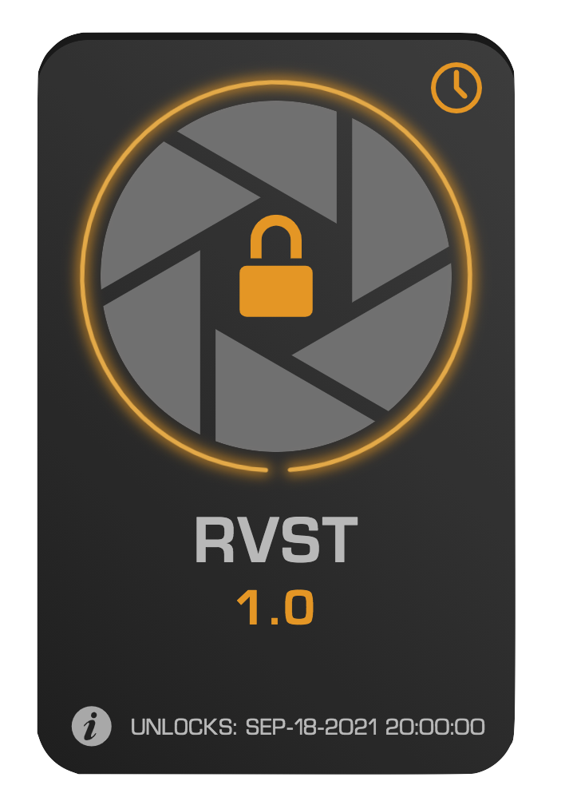

Time locks are locks that unlock when a specified date has been reached. While future UI upgrades will likely enable them to unlock at a specified time in addition to a desired date, for the time being, they unlock at 00:00:00 GMT on the chosen date. 

    

  

## Details on Time Lock Configuration

- Unlock Date: The date on which the FNFT locked to this time-lock will unlock

## Applications for Time Locks

- Traditional Time-Cliff Vesting Structures for Private Round Investors
  - In cases where taking liquidity on vested tokens is desired, FNFTs offer unparalleled ease of use. Rather than requiring a proprietary exchange, standardized packets of value can be bought and sold on well-known and trusted platforms such as OpenSea or EcoFi
- Liquidity Pool (LP) Token Vesting 
  - Traditional LP locks don't allow for acquisitions or partial-acquisitions of the rights to their underlying LP tokens – this makes it very difficult to effect meaningful acquisitions of part or all of a crypto project. FNFTs solve this problem by allowing for fractionalization of LP tokens without having access to the underlying LP's in a way that would allow the holder to withdraw liquidity from the pool.
- Endowments
- Inheritances
- Gift
- College Fund
- Charitable Donation
  