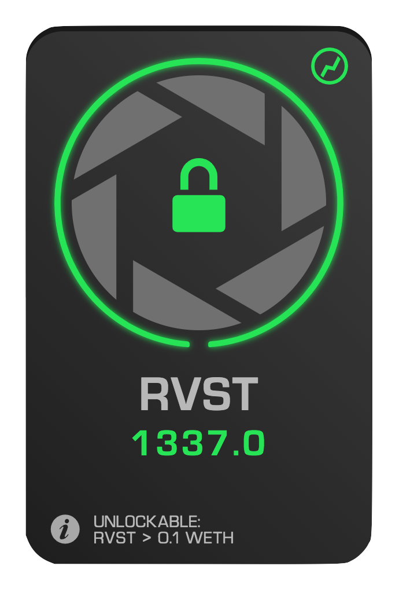

Value Locks are locks that unlock when the value of one asset (primary asset) relative to another asset (comparative asset) either rises above or falls below a price chosen during minting. Both assets are selected by the creator during the minting process, and the creator does not need to own either one of them.

    

  

## Oracles
<!-- TODO: Check links -->
To prevent "price-hacking" (the manipulation of on-chain pricing information, often through the use of flash-loans) Revest utilizes on-chain price-oracles (Oracles) to measure the value of one asset relative to another. Revest currently offers oracles based on Chainlink Price Feeds and a Uniswap V2 TWAP (Time-Weighted Average Price). Planning is currently underway to establish a VWAP (Volume-Weighted Average Price) oracle for arbitrary time periods with one of Revest's launch partners. Support for Uniswap v3 is also likely post-launch. 

In many cases, oracles will not exist for unusual choices of comparative assets – for this reason, the following are suggested as typical choices for  comparative assets:

- Wrapped Ethereum (WETH) – the ERC-20 variant of Ethereum
- USD – Pegged to the United States Dollar
- USDC – US Dollar Coin, an ERC-20 pegged to the value of USD
- DAI – Another ERC-20 token pegged to the value of USD

### Oracle Updates
Some oracles (namely, the Uniswap v2 TWAP) will require updates on occasion to allow for proper price measurements. These updates will require the user to submit an update request via the Info panel, wait for it to process, then submit their withdrawal or unlock request. Should this be the case, the UI will change accordingly. 

## Unlocking
Value locks, when they become mature, are eligible for either unlocking or withdrawal. As all transactions on-chain require direct initiation by an individual willing to pay gas for the transaction, value-locked FNFTs cannot automatically unlock. Once a value-locked FNFT has become unlockable, it is possible for it to once again become fully locked, should its unlock price fall out of the zone in which the FNFT can become unlocked. 

To allow for Value Locked FNFTs (VL-FNFTs) to be unlocked without being withdrawn from, once a VL-FNFT becomes unlockable, it can be unlocked from within it's Info panel. Unlocking the FNFT will allow it to be withdrawn from at any point in the future, and all other FNFTs that share the lock will also become unlocked. 

## Details on Value Lock Configuration
<!-- TODO: Check links -->
- Primary Asset: the token to check the price of; can choose common assets from a list, or paste lesser-known ERC-20 assets to import them
- Comparative Asset: the token to check the price of the primary asset in. Often USD or ETH, though more esoteric units are possible, depending on the oracle chosen
- Oracle: The on-chain price oracle to measure the value of the primary asset relative to the comparative asset with. Two options are currently available (though more are planned and the IOracleDispatch module is fully open-source):
  - Chainlink Price Feeds: Chainlink Price Feeds: Chainlink is one of the most well-known and well-established oracle providers in DeFi, and offers a wide variety of oracles that are entirely free-to-use. 
    -  Will only ever require one transaction to withdraw from, recommended when feeds are available (only available for certain pairs)
  -  Uniswap v2 TWAP: A time-weighted average price (TWAP) oracle based on trading pairs availabel on the Uniswap v2 DEX. This oracle takes the average of the last two prices it has measured, across whatever window of time that may be. 
     -  Will require at most two transactions to unlock. Recommended for new or esoteric cryptos 

## Applications for Value Locks
<!-- TODO: Check links -->
- Vesting with team-incentives (Key Performance Indicators or KPIs)
  - Unlocking of team tokens can be tied to increases in market cap to incentivize performance based on project success rather than passage of time
- Vesting for individual investors
- Price stabilization: value can be automatically locked and unlocked at certain thresholds to apply buy and sell pressure selectively
- Limit-like structures: FNFTs may have their funds routed to an AMM upon withdrawal and converted into units of another currency automatically (see Directed Output for more info)