For this tutorial, we will be locking 1 RVST token into one FNFT, which will unlock after a pre determined value has been reached by the Chainlink (LINK) token. Chainlink's oracle will be verifying the value of LINK tokens for us in this presentation. We will be covering a simple configuration value-lock FNFT which will unlock when LINK tokens reach a specific value pre-determined by the User.

## Step One
Connect your ERC20 wallet to https://app.revest.finance/mint by clicking "Connect Wallet" in the upper right hand corner of the User Interface.

    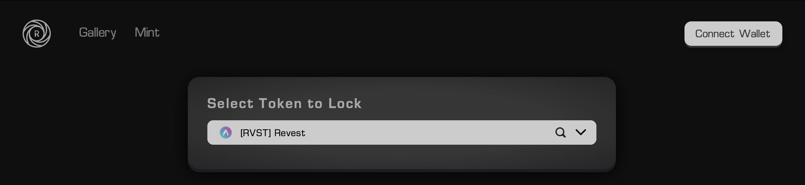

Click "Connect Wallet" in the upper right hand corner above

    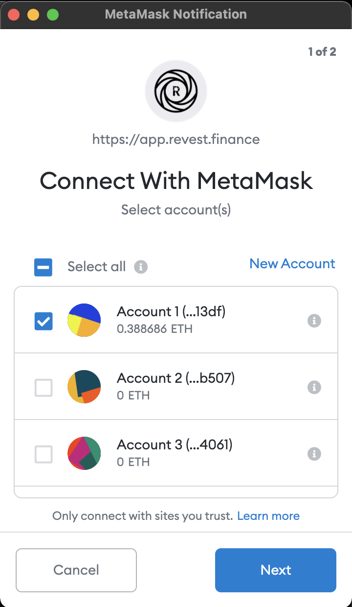

Click "Next" & connect with your MetaMask wallet to begin minting.

## Step Two 
Now that you have your wallet connected and are on the mint page, you have the option to mint a value-locked FNFT with a pre determined value. The UI will open up with 1 Token being locked into 1 FNFT as a default, however the FNFT will not unlock until the value goes either above or below the price set by the user.  

    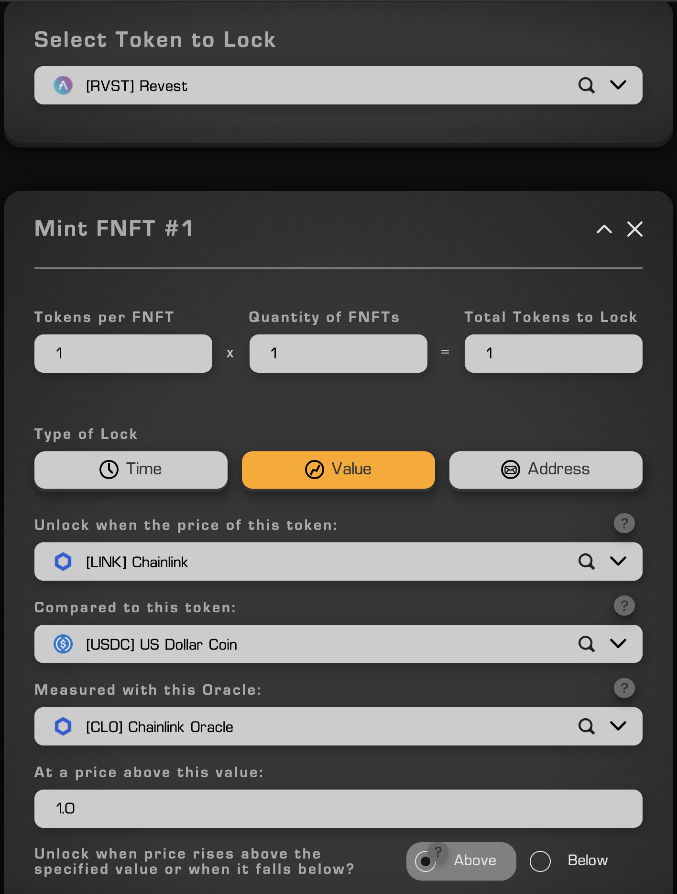

The orange icon lit up shows we are in the "Value" lock configuration

As you can see above, I am depositing 1.0 RVST token into 1 value-lock FNFT. This FNFT which holds one RVST token is currently set to unlock when the price of LINK is above 1.0 USDC (based on the above configuration). Chainlink Oracle will be used to calculate the price of each token, which will make sure the FNFT cannot unlock unless the price is above 1.0 USDC token.

    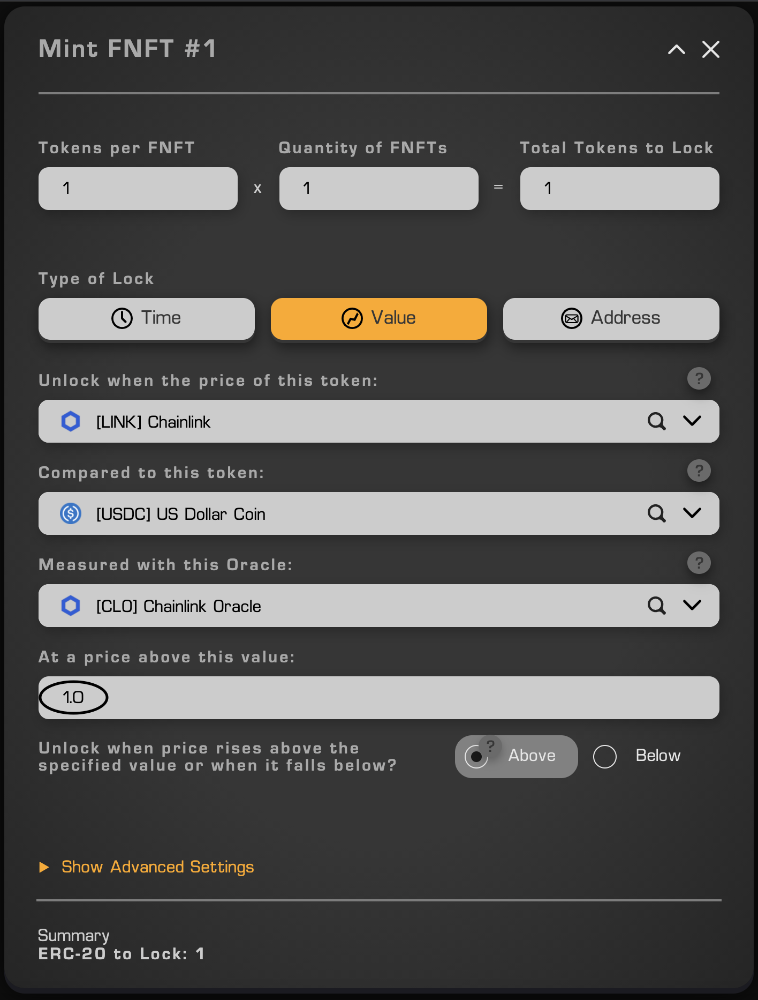

The FNFT is set to unlock when the price of LINK is "Above" 1 USDC

We are not opening the "Advanced Settings" tab, as this is only a basic value-lock FNFT configuration. We have selected the "Above" with the value being set as 1 USDC, therefore if LINK is worth more than 1 USDC the FNFT will unlock. Since we know LINK > 1 USDC, this FNFT should be unlocked and the RVST token inside of it available for withdrawal immediately upon minting. 
The above photo also shows that we are minting 1 token into 1 FNFT. 

## Step Three

At this stage, we are ready to mint. After confirming your FNFT configuration, scroll down and click "Approve" on the User Interface.  

    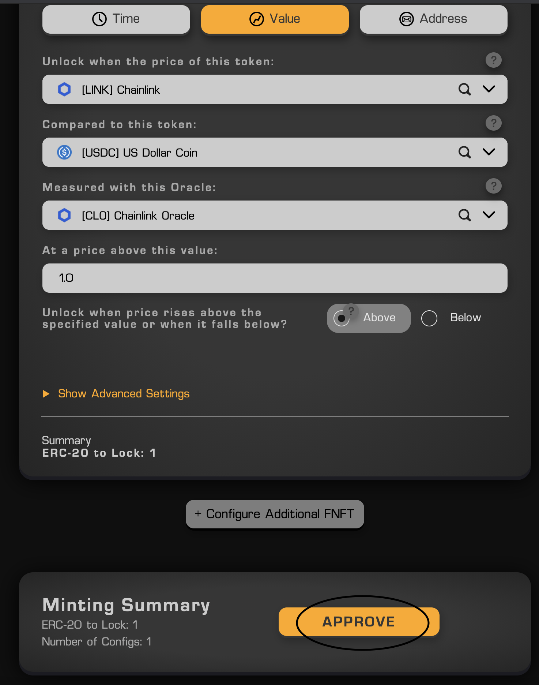

The FNFT has been configured, now we can scroll down and press "Approve"

The MetaMask wallet will open after you have clicked "Approve". At this point we need to press "Confirm" in the MetaMask wallet. This will allow the Smart Contract to deposit your RVST tokens into the FNFT.

    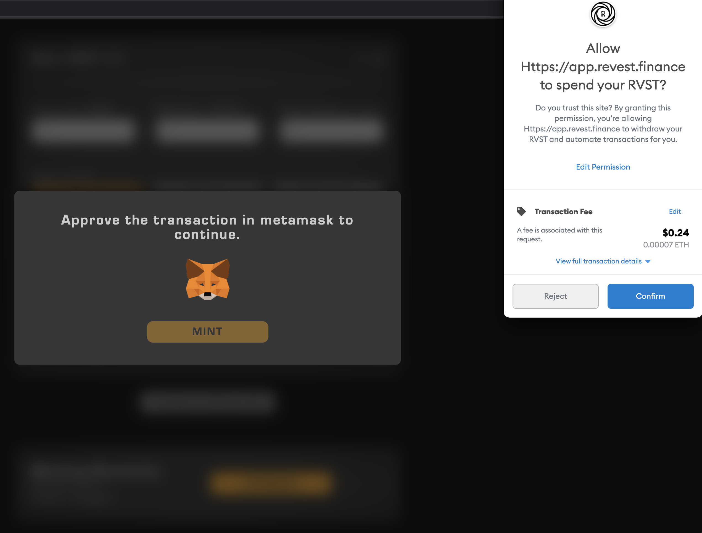

Click the blue "Confirm" transaction button in your MetaMask wallet

After confirming the transaction, the User Interface will show your transaction as "Approval Processing".  

    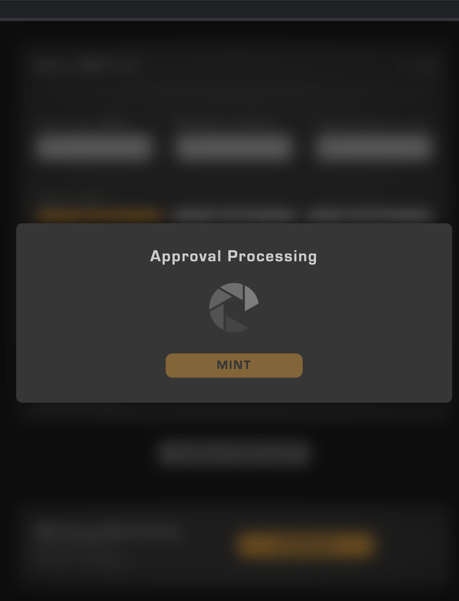

The UI shows "Approval Processing" until the transaction has been completed

After the transaction has been completed, a green checkmark will appear and you are ready to mint your FNFT! 

    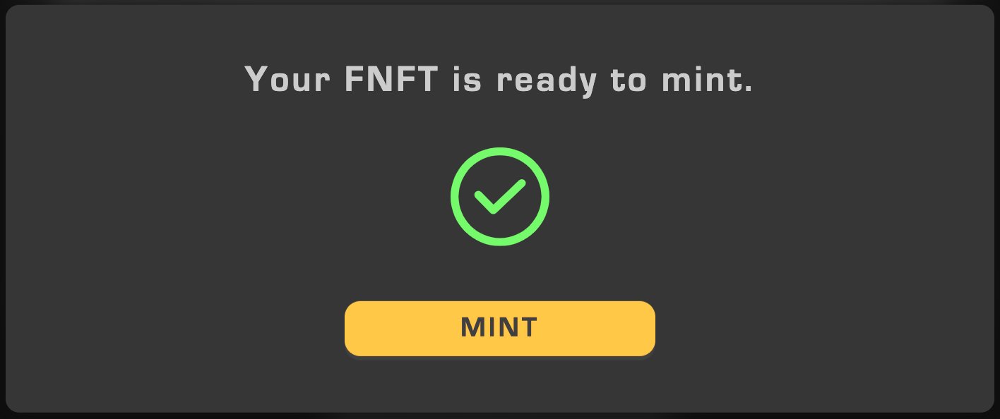

Once your FNFT is ready to mint, click "Mint" below the green checkmark

Now that you have submitted your FNFT to the Ethereum blockchain for minting, you will have to submit the final transaction using your MetaMask wallet.  

    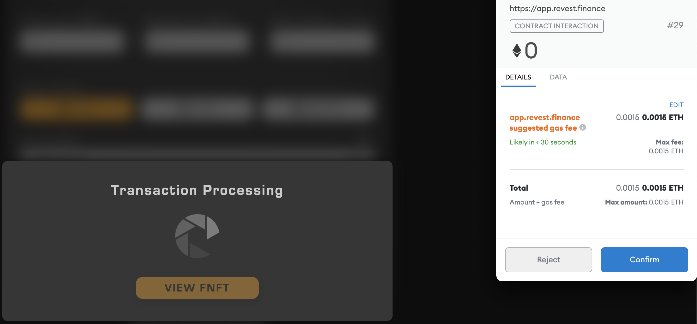

Press "Confirm" in your MetaMask wallet, make sure to have ETH for gas fees

## Step Four
Now that you have confirmed the transaction which will mint your FNFT on the ethereum blockchain, you are ready to view your first FNFT. You will be given a prompt by the User Interface that the transaction has been successfully confirmed on the blockchain. The message is telling you that the FNFT could take some time to appear on chain depending on network traffic, but it is usually visible in your gallery instantaneously.  

    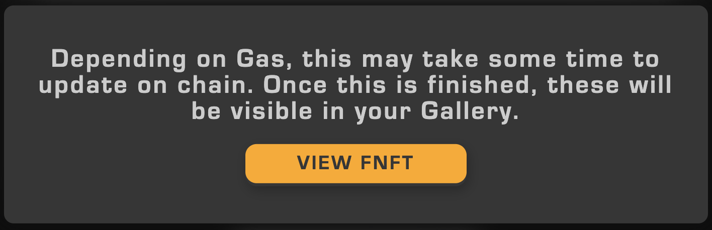

This message confirms the FNFT has been minted, now click "View FNFT"

    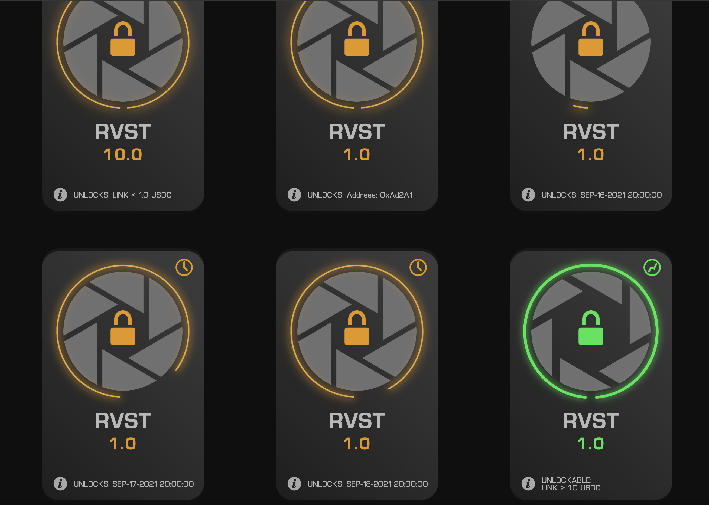

After being sent to "Gallery", you can see every FNFT in your Ethereum wallet

Once your Gallery has been updated on chain, you can click on an FNFT inside of it. After clicking on an FNFT, it will open up and show you more information, such as the date the FNFT was minted, and in this case the value at which it will unlock. 

As you can see in this case the FNFT is green, meaning it is unlocked. Since the price of Chainlink (LINK) tokes are above 1 USDC, which has been verified by the Chainlink Oracle, our FNFT has been unlocked since it was first minted. If you check on the FNFT in the upper left corner for perspective, it can't unlock, because the price of LINK needs to be below 1.0 USDC in order for it to do so.

You also have option to send your FNFT to another address, and once the value lock has unlocked you can withdraw your assets by clicking "Withdraw" at the bottom of the page.

    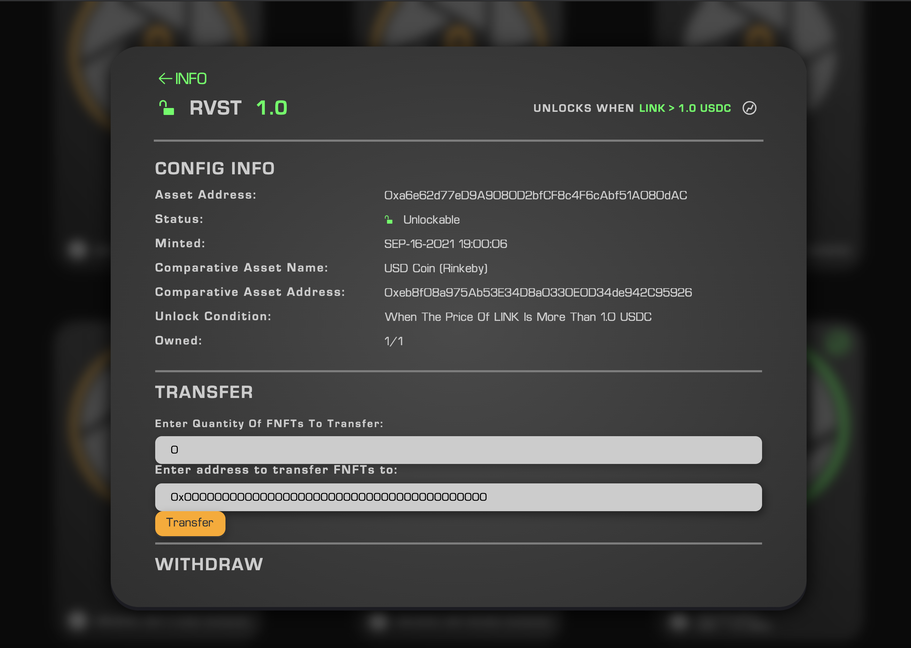

The value LINK has to be so the FNFT unlocks is shown in the top right corner

As you can see this is the FNFT we minted above with 1.0 RVST tokens locked inside of it until the price of Chainlink (LINK) tokens are above 1.0 USDC. The lock in the upper hand left corner shows you that there is one RVST token unlocked and ready to be withdrawn from this FNFT. 

If we had set the FNFT to unlock when the price of Chainlink (LINK) tokens was set to below 1.0 USDC, it would still be locked, this is because the Chainlink Oracle knows that LINK is currently priced at about 30 USDC (example of FNFT configured with these properties shown below). 

    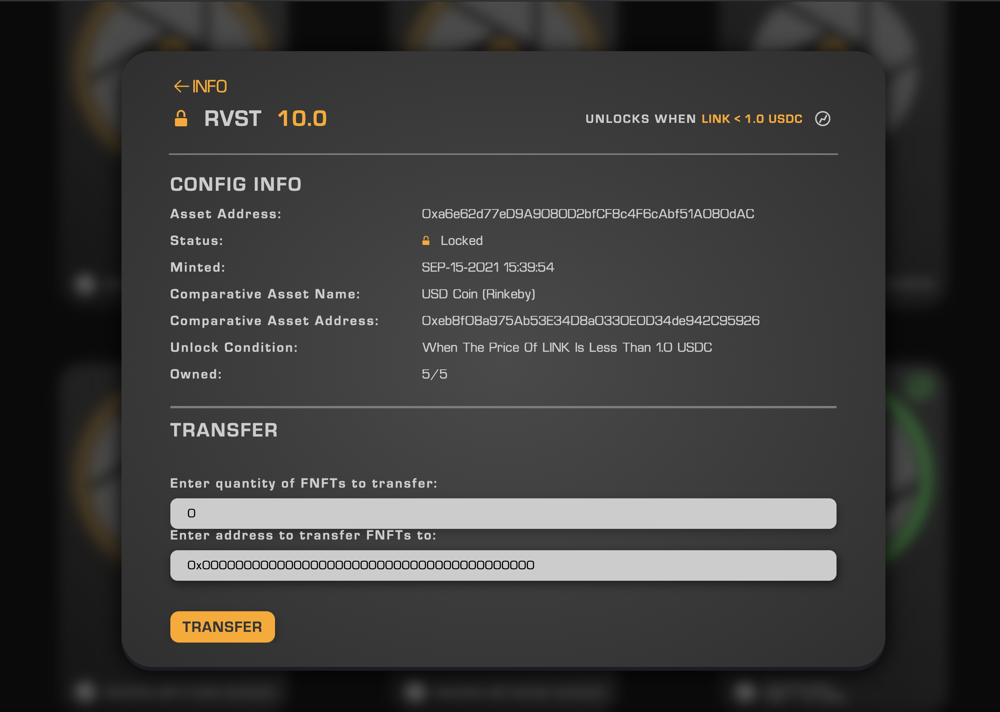

This FNFT is locked indefinitely, until the price of LINK is below 1.0 USDC

## Step Five

The final step is to withdraw your tokens from the FNFT once it unlocks due to the value which was pre determined upon minting. Since Chainlink (LINK) tokens are more expensive than 1.0 USDC, the value lock FNFT has been unlocked since it was first minted.  You will notice your FNFT is unlock able becuase the lock is opened and the FNFT is coloured green, it will also say "UNLOCKABLE" at the bottom.   

    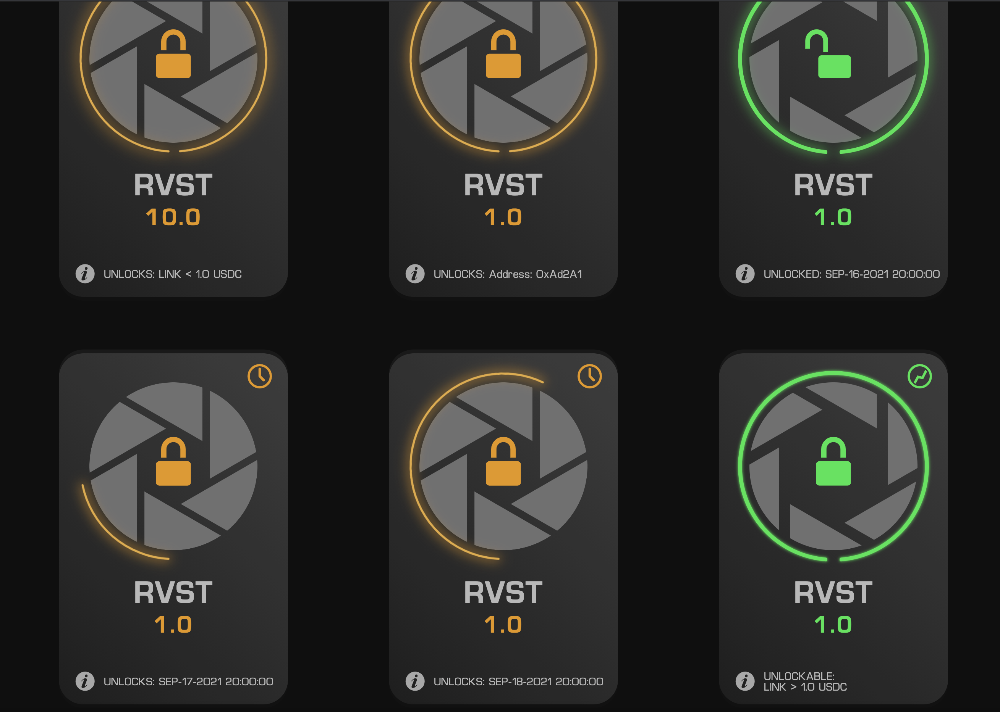

The green FNFT in the bottom right hand corner is unlocked 

To unlock your FNFT and withdraw the underlying assets, click on the green "UNLOCKABLE" FNFT, after that go to the bottom and click "Withdraw"  

    

After seeing your FNFT has unlocked, click "Withdraw" at the bottom

    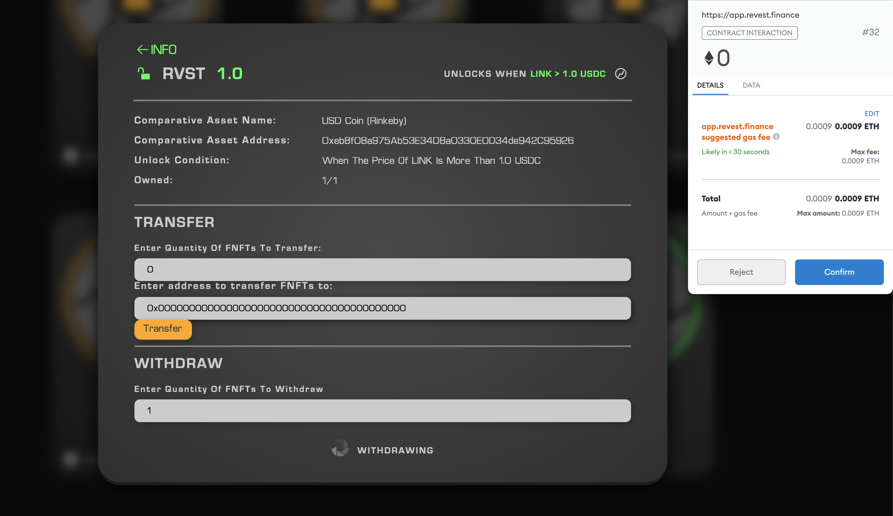

After pressing "Withdraw", click "Confirm" in your MetaMask wallet

Now that you have confirmed your withdrawal, you will see "Withdrawing" at the bottom of your FNFT. After the transaction has completed, it will show say "Your NFT has been withdrawn" at the bottom of the screen.  

    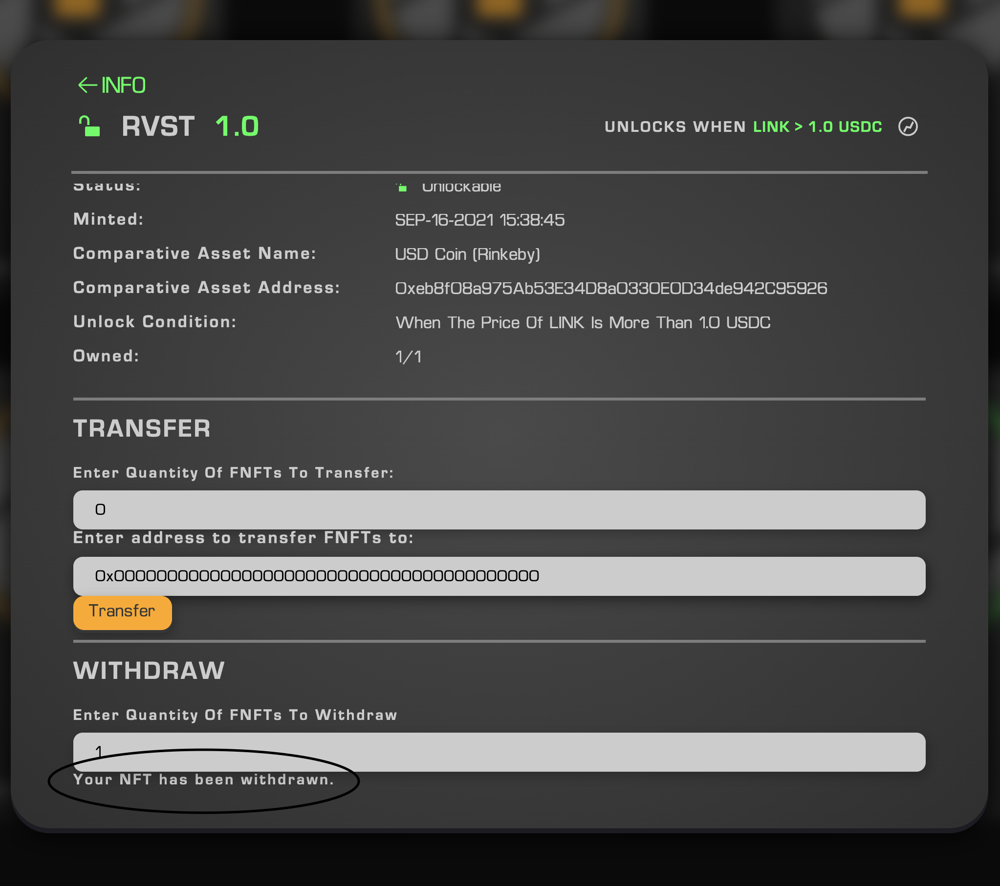

At the bottom of the screen, it shows "Your NFT has been withdrawn"

Now that the underlying assets have been withdrawn from the FNFT, you will be able to find your RVST token (which had been previously locked), back inside of your MetaMask wallet. After withdrawing your tokens, the FNFT will no longer be visible inside of your Gallery. 