For this tutorial, we will be locking 1 RVST into one FNFT for two days. We will be covering a simple configuration time-lock FNFT which will unlock on a specific date pre-determined by the User.

## Step One 

Connect your ERC20 wallet to  by clicking "Connect Wallet" in the upper right hand corner of the User Interface.

    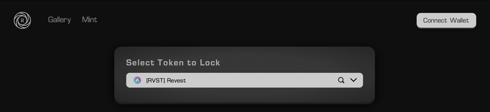

> Click "Connect Wallet" in the upper right hand corner above

    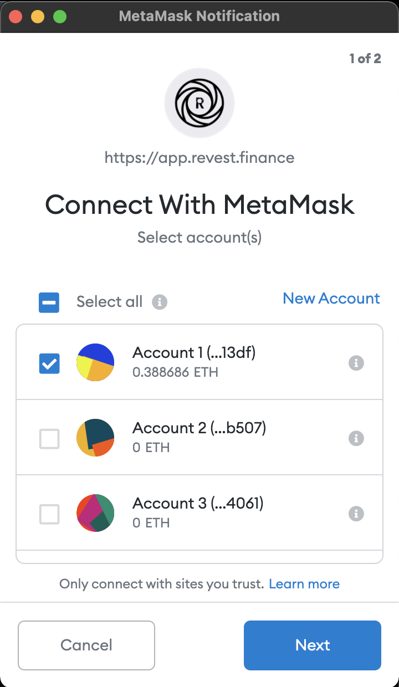

> Click "Next" & connect with your MetaMask wallet to begin minting

## Step Two 

Now that you have your wallet connected and are on the mint page, you have the option to mint a time-locked FNFT with a pre determined date. The UI will open up with 1 Token being locked into 1 FNFT as a default, the only thing left to choose at this point is the date that the FNFT will unlock allowing you to withdraw your tokens.

    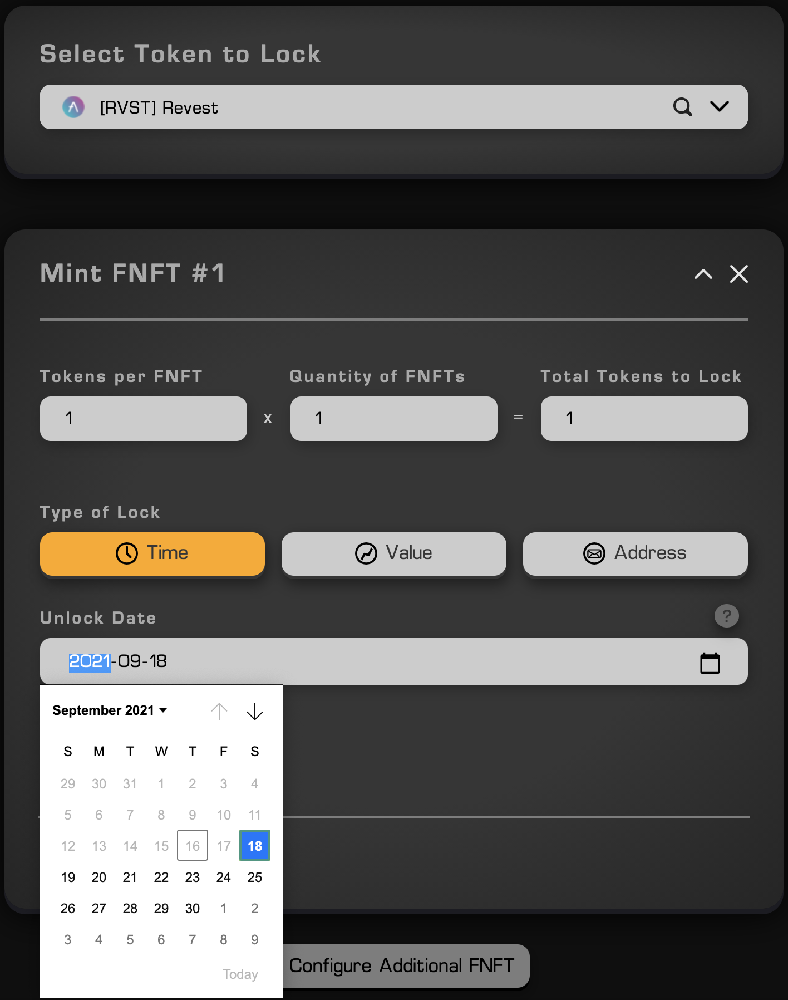

> Click on the calendar in the unlock date column to choose the date

    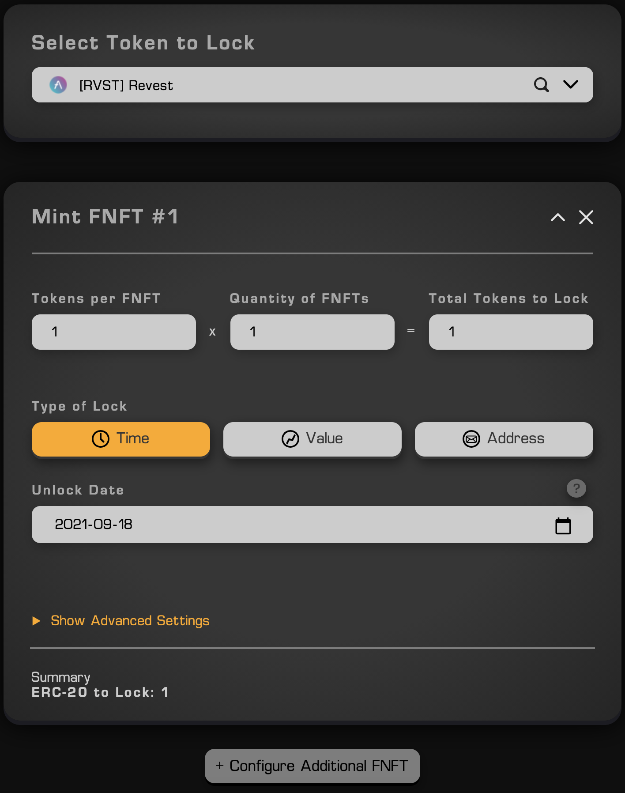

> We're minting 1 RVST token into 1 FNFT

The above photo shows the unlock date and time, while also showing that we are minting 1 token into 1 FNFT. 

## Step Three

At this stage, we are ready to mint. After confirming your FNFT configuration, scroll down and click "Approve" on the User Interface.  

    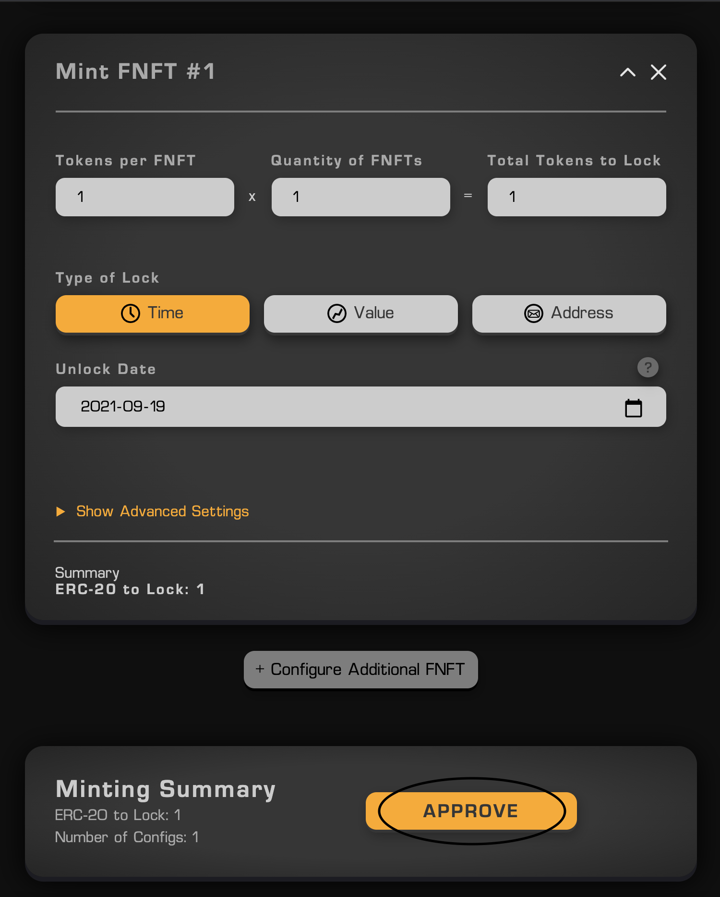

> The FNFT has been configured, now we can scroll down and press "Approve"

The MetaMask wallet will open after you have clicked "Approve". At this point we need to press "Confirm" in the MetaMask wallet. This will allow the Smart Contract to deposit your RVST tokens into the FNFT.  

    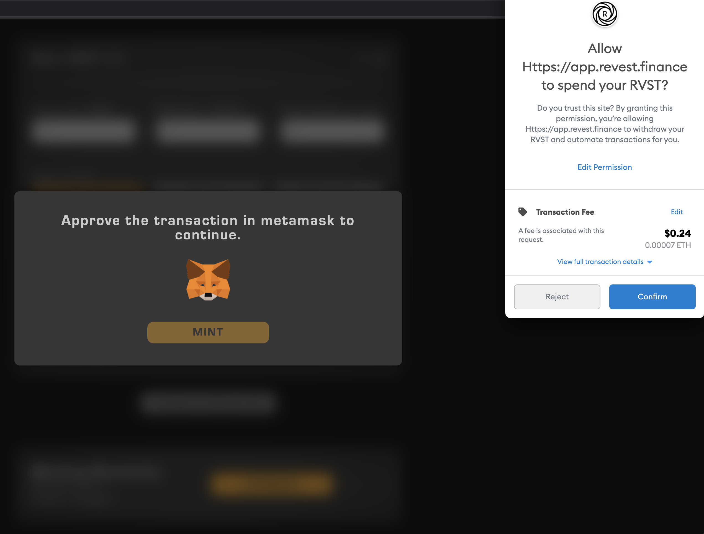

> Click the blue "Confirm" transaction button in your MetaMask wallet

After confirming the transaction, the User Interface will show your transaction as "Approval Processing".  

    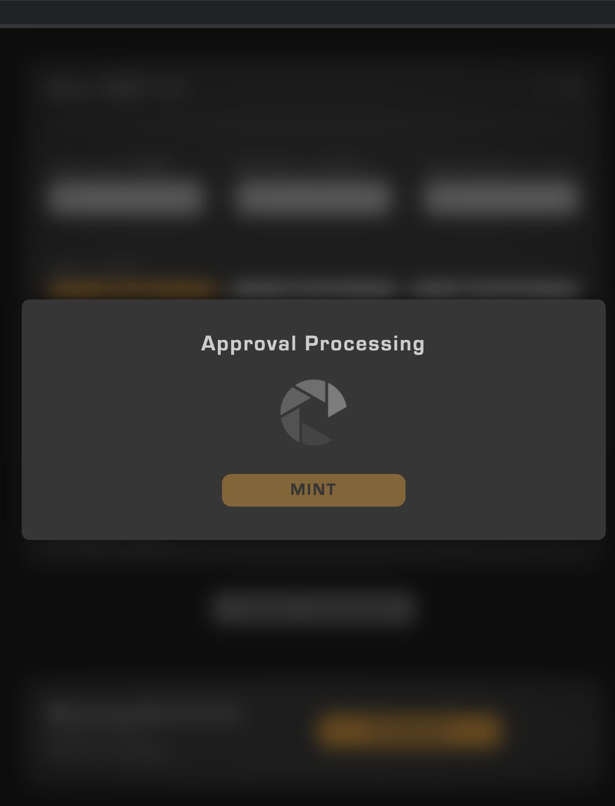

> The UI shows "Approval Processing" until the transaction has been completed

After the transaction has been completed, a green checkmark will appear and you are ready to mint your FNFT!

    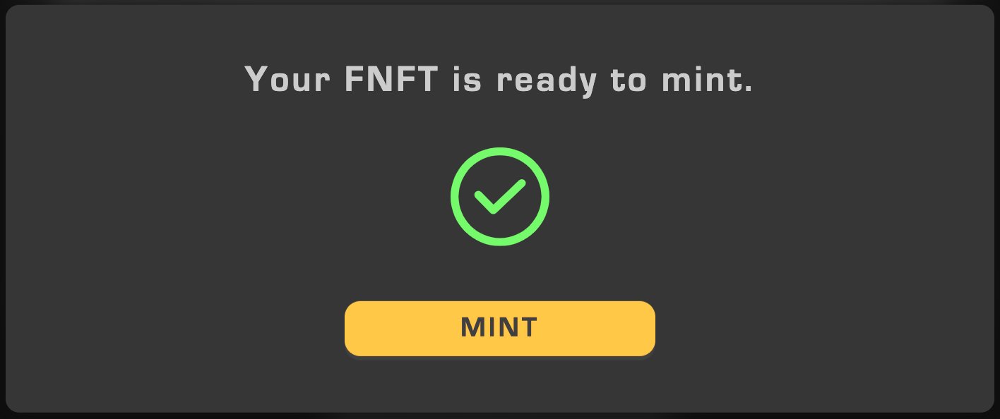

> Once your FNFT is ready to mint, click "Mint" below the green checkmark

Now that you have submitted your FNFT to the Ethereum blockchain for minting, you will have to submit the final transaction using your MetaMask wallet.  

    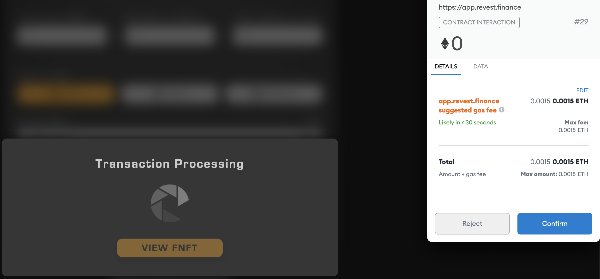

> Press "Confirm" in your MetaMask wallet, make sure to have ETH for gas fees

## Step Four

Now that you have confirmed the transaction which will mint your FNFT on the ethereum blockchain, you are ready to view your first FNFT. You will be given a prompt by the User Interface that the transaction has been successfully confirmed on the blockchain. The message is telling you that the FNFT could take some time to appear on chain depending on network traffic, but it is usually visible in your gallery instantaneously.

    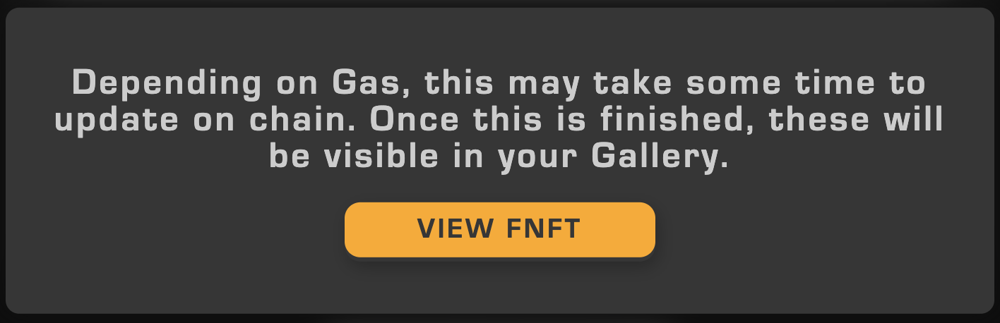

> This message confirms the FNFT has been minted, now click "View FNFT"

After clicking "View FNFT, you will be taken to your Gallery where you can see all FNFTs you have minted and still hold in your Ethereum wallet address.  

    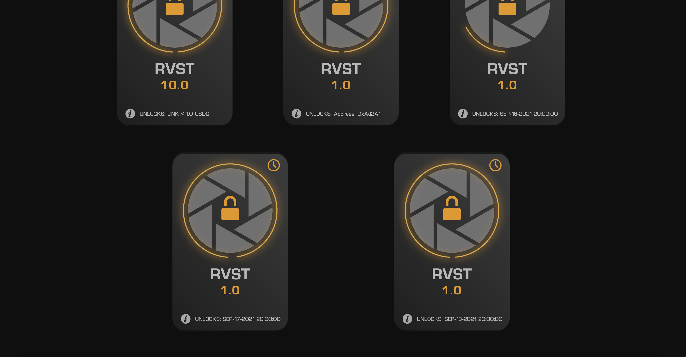

> After being sent to "Gallery", you can see every FNFT in your Ethereum wallet

Once your Gallery has been updated on chain, you can click on an FNFT inside of it. After clicking on an FNFT, it will open up and show you more information, such as the date the FNFT was minted, and the date at which it will unlock.

You also have option to send your FNFT to another address, and once the time lock has completed you can withdraw your assets by clicking "Withdraw" at the bottom of the page.

    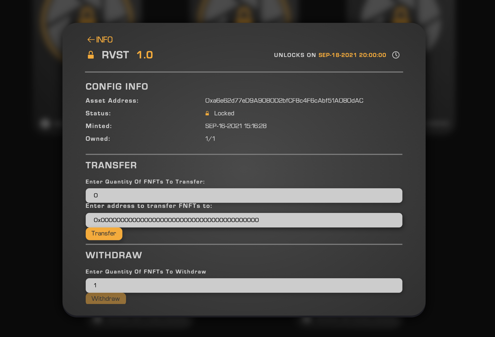

> The unlock date for this FNFT is shown in the top right corner 

As you can see this is the FNFT we minted above with 1.0 RVST tokens locked inside of it until September 18th 2021. The lock in the upper hand left corner shows you that there is still one RVST token locked inside of this FNFT. 

## Step Five

The final step is to withdraw your tokens from the FNFT once it unlocks on the date of September 18th 2021. It is still Sept 16th currently, so I have minted a different kind of FNFT which is based on a value lock and will be unlockable instantaneously in order to show case the withdrawal function. You will notice your FNFT is unlock able after it has changed from orange to green, it will also say "UNLOCKABLE" at the bottom.

    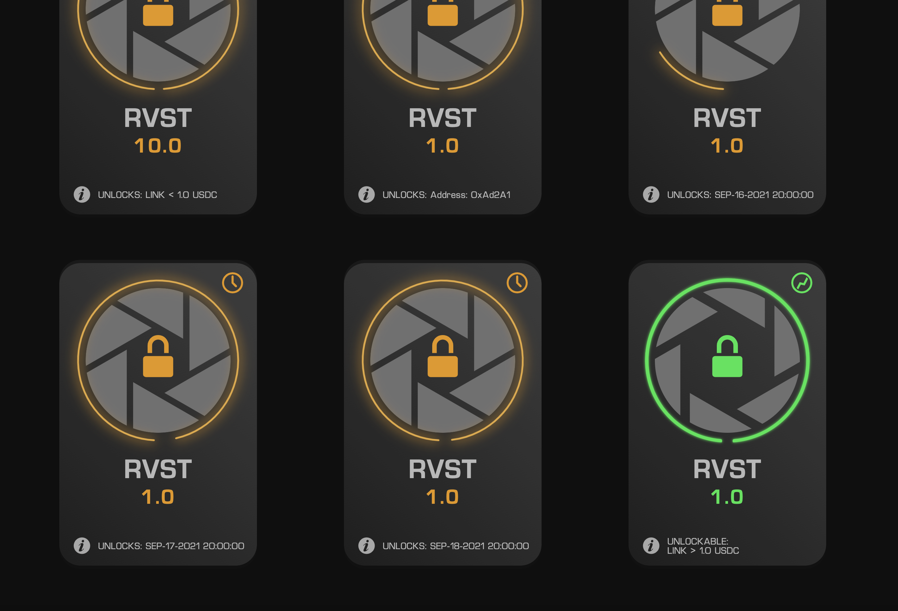

> The green FNFT in the bottom right hand corner is unlocked  

To unlock your FNFT and withdraw the underlying assets, click on the green "UNLOCKABLE" FNFT, after that go to the bottom and click "Withdraw"

    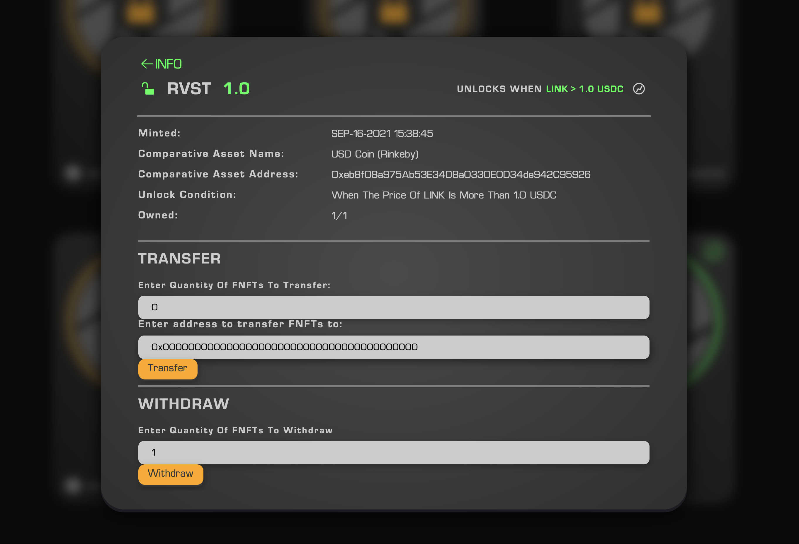

> After seeing your FNFT has unlocked, click "Withdraw" at the bottom

    

> After pressing "Withdraw", click "Confirm" in your MetaMask wallet

Now that you have confirmed your withdrawal, you will see "Withdrawing" at the bottom of your FNFT. After the transaction has completed, it will show say "Your NFT has been withdrawn" at the bottom of the screen. 

    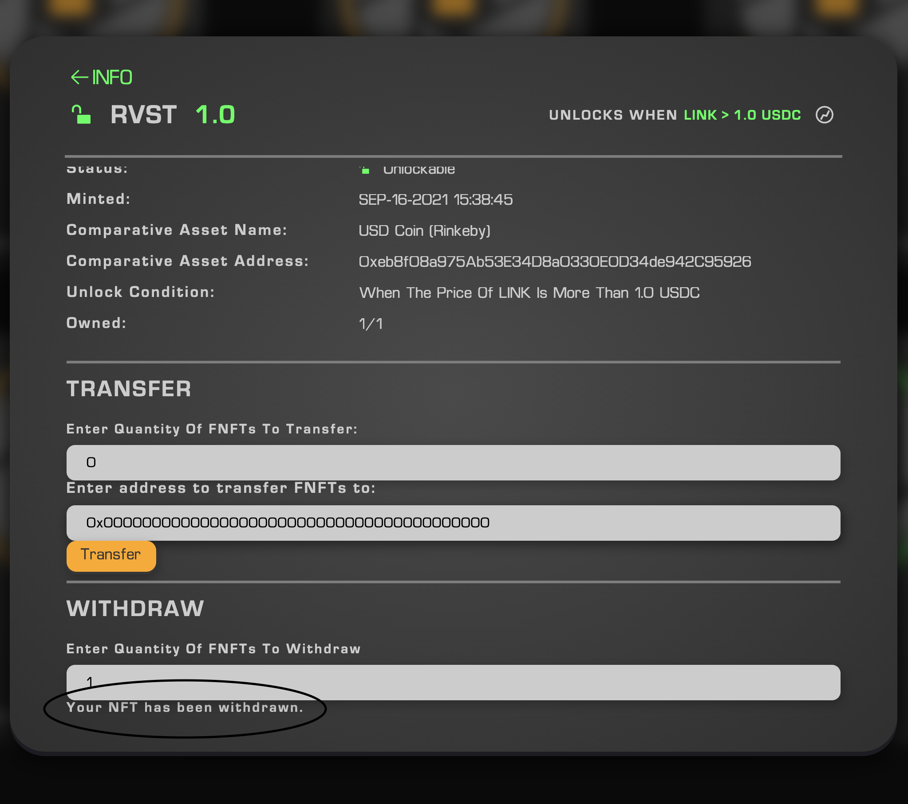

> At the bottom of the screen, it shows "Your NFT has been withdrawn" 

Now that the underlying assets have been withdrawn from the FNFT, you will be able to find your RVST token (which had been previously locked), back inside of your MetaMask wallet. After withdrawing your tokens, the FNFT will no longer be visible inside of your Gallery. 
