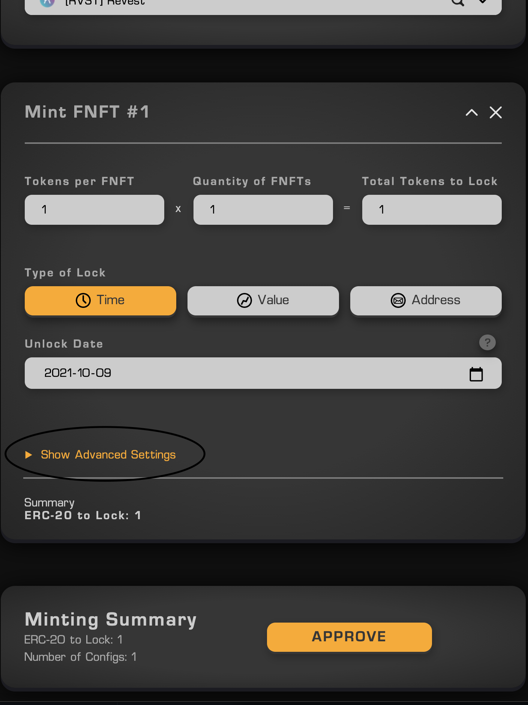
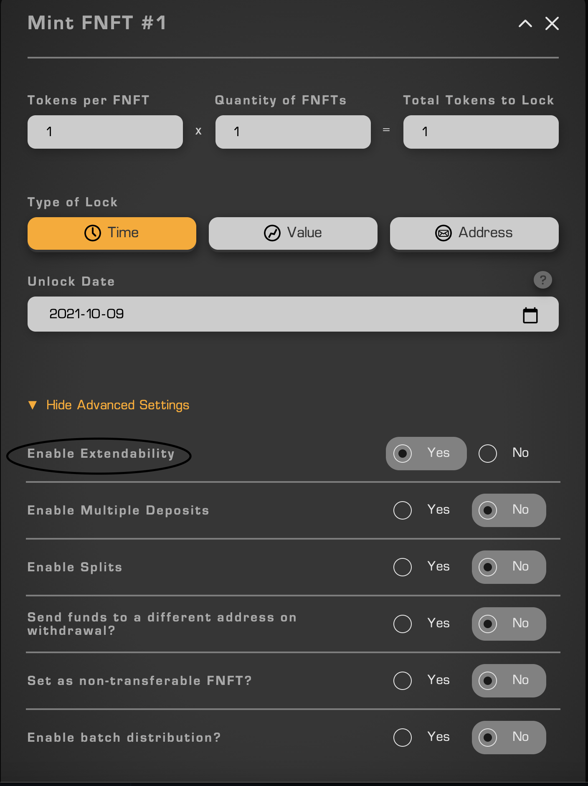
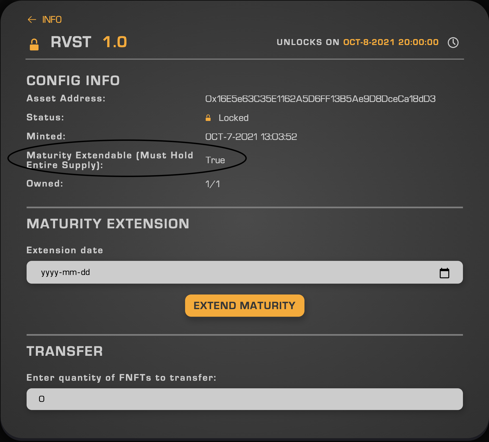

This turorial will explain how to use the "Enable Extendability" function under Advanced settings when minting FNFTs with the Revest Protocol. The Extendable Maturity function is only available for Time lock FNFTs, as it requires a specific unlock date in order to for the function to work.

    

> Click "Show Advanced Settings" above the Minting Summary of your FNFT

    

> When minting your FNFT, click "Yes" beside "Enable Extendability"

Now we are ready to mint an NFT with Extendable Maturity. When the unlock date for the FNFT has reached it's maturity, the underlying assets will be available for you to withdraw. If you would like to re-lock your FNFT after it has unlocked (without having to withdraw the assets and mint a second FNFT), we suggest you mint your FNFT with the "Enable Extendability" function set to "Yes". 

    

> After minting, you can confirm your FNFT is extendable by looking at the configuration information

You will notice the FNFT you've minted now says "Maturity Extendable (Must Hold Entire Supply) : True", this means you cannot extend the maturity of the FNFT unless you hold 100% of its supply. An example where you no longer hold 100% of the FNFT's supply is when you use the "Splitting" function to split the FNFT into two, thus sending half the supply to a new address. As previously stated, in order to extend the maturity to a new date, you have to own 100% of the FNFTs supply.

