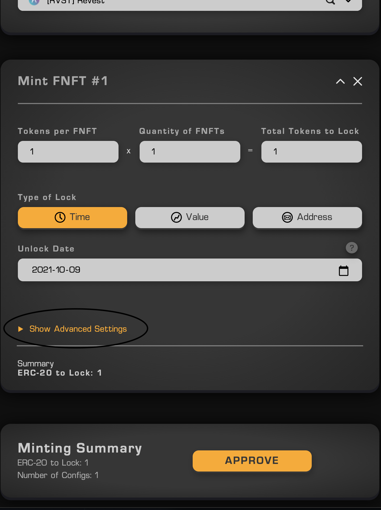

> This is a tutorial to show how one can successfully make multiple deposits to the same FNFT.

This turorial will explain how to use the "Enable Multiple Deposits" function under Advanced settings when minting FNFTs with the Revest Protocol. You can use this function with time, value, and address lock FNFTs.

    

> Click "Show Advanced Settings" above the Minting Summary

