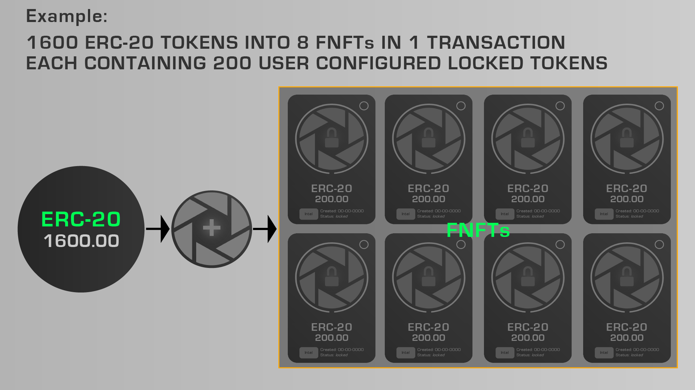
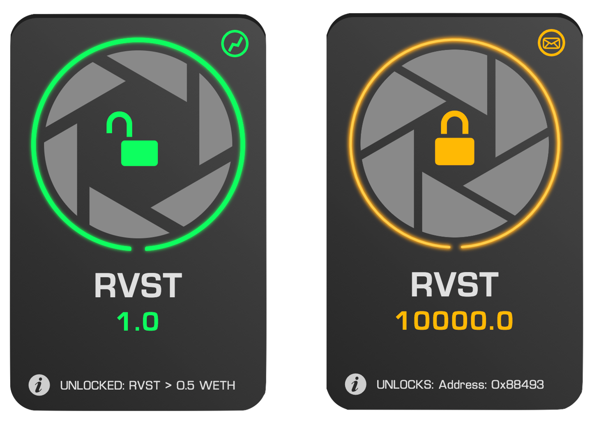
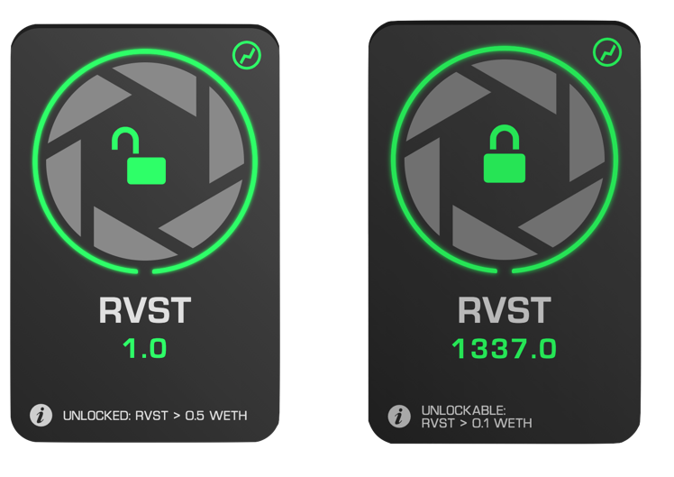

Everything about Revest you wanted to know but that the devs wouldn't tell you

## What is Revest?
Revest is a new protocol for locking ERC-20 tokens into ERC-1155 NFTs – the resulting Financial Non-Fungible Tokens representing a new asset class within the crypto ecosystem. 

## How Locking Works

    

  

As described by the above figure, FNFTs are created when a set amount of ERC-20 tokens is deposited into a Revest Smart Vault. The newly created Smart Vault will only return the underlying tokens to actors who satisfy the following two conditions: 

1. Possession of the FNFT itself

2. One of the three possible locking mechanisms (Time, Value, or Address) placed on the vault at creation has unlocked

For the underlying value to be retrieved from the Smart Vault, the FNFT representing a packet of that underlying (200 ERC-20s, in the above example) must be burned and the locking mechanism on the Smart Vault must be satisfied.

For example: If I hold three of the above eight FNFTs, I am entitled to 600 ERC-20s when the lock attached to this series of FNFT has unlocked. For the sake of example, if that lock were set to unlock in a week, once that week had elapsed, I could exchange the FNFT with the Revest Smart Vault to retrieve the underlying 600 ERC-20s. 

NB: If the lock has not unlocked, I cannot use the FNFTs I hold to retrieve the underlying assets.
NB: If I do not hold any of the FNFTs for this particular smart vault, I cannot retrieve the underlying assets. 

## FNFTs are NFTs

FNFTs possess all the attributes of typical NFTs and are fully compatible with all marketplaces, wallets, and interfaces that support typical ERC-1155s. **FNFTs can be bought and sold just as a typical ERC-1155 would be**, and this flexibility means that Revest has.

## Value in FNFTs is Locked
While FNFTs may be freely transferred between wallets and smart contracts, the value underlying them remains locked in the Revest Smart Vault until the lock is released and the FNFT redeemed. So while the actual FNFT itself may be traded, the transfer will not and cannot directly effect the market value of the assets underlying the FNFT.

## FNFT Interface
Through the use of a novel and groundbreaking javascript interface, FNFTs can display up-to-date information on their contents and their locked state.

The color of an FNFT indicates whether it is locked or unlocked: 

- Green means unlocked
- Amber means locked

    

  

Two different FNFTs. The one on the left is unlocked, while the one on the right is locked

<!-- TODO: Links -->
FNFTs can also be in a state where they are "unlockable" but not "unlocked". This doesn't occur for Time Locks, but can for both of the other two choices. In this state, you'll be able to unlock the FNFT if you own one, unlocking it for everyone else who owns it as well; they'll still have to withdraw from it to get the underlying value out though!

Whether an FNFT is unlockable is easily determined by the appearance of central padlock on the FNFT itself:

    

  
The FNFT on the left is unlocked. The FNFT on the right is unlockable

