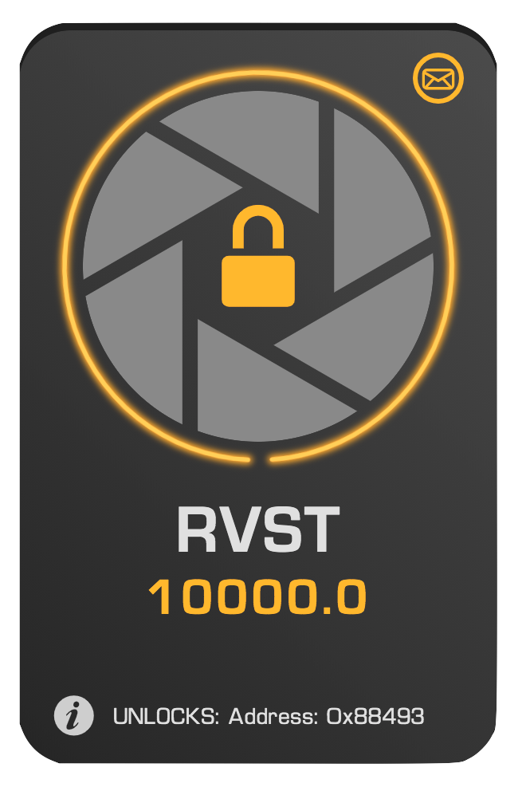
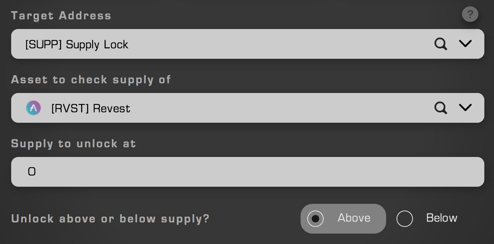
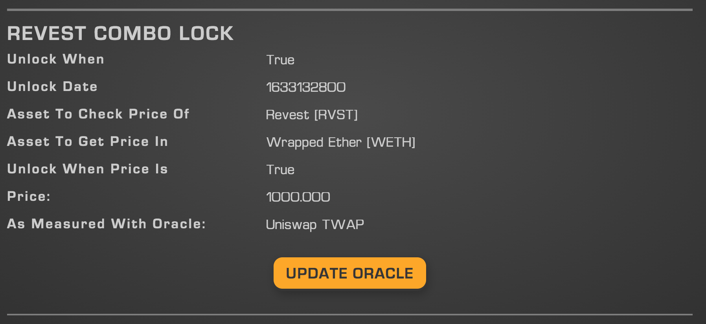

Address locks are by far the most powerful and composable locks offered by the Revest Protocol. Fundamentally speaking, an address lock is a lock that uses an Ethereum address (eg: 0x99E004714669CF776B31e9b4448994D4cCEb4fC0) as the trigger for unlocking the Smart Vault to which it is attached. There are two mechanisms by which the address associated with the lock may accomplish this: 

- By calling the "unlock" function on the Revest smart contract, easily done through the Revest UI in cases where the user's ETH address is the one associated with the address lock
  - For example: User A creates address lock 1 which is associated with 10 FNFTs (of the same series), designated 'FNFT1', each containing 20 RVST, and with their unlocking address set to User A's wallet address. User A shares 3 of these with User B, and 4 of these with user C, leaving User A with 3 copies of FNFT1. User A then calls the unlock function from the Revest UI, unlocking all the FNFTs in the series. Users B and C may also now withdraw from the copies of FNFT1 they received.
  - This functionality is not limited to wallets. A smart-contract may also call the "unlock" function directly from the blockchain on an address lock, allowing for highly versatile systems to be constructed. This is an alternative approach to the recommended methodology for smart-contract integration with address locks.
- By having the address specified at creation be a smart contract implementing the Revest Address Lock Interface. Through the use of a predefined metadata file, smart contracts of this nature can easily integrate with the Revest minting UI and gather arbitrary information from any user seeking to create a lock with these generalized systems. The benefits of this system include:
  - **Completely customizable locks:** Locks can be triggered by any set of inputs, on- or off-chain, provided the data is brought on-chain through the use of oracles
  - **Separation of locking mechanism and value storage:** separation of value storage and locking mechanics reduce the security impact of lock-failure and reduce worst case from theft of locked value to early-access of locked value by authorized parties (only FNFT holders)
  - **Community sourcing of locks:** Locks can be shared simply by pasting in the address to one that is already deployed
    - Revest is invested in our community. Well-written and useful locks will be added to our presets. 
  - **Reusability of locking mechanics:** No more reinventing the wheel between DAOs
  - **Seamless user experience:** Lock metadata files allow for end-users to interact with custom locks in native Revest UI, avoiding confusion of clunky direct blockchain interaction

    

  

## Custom Address Locks: the True Potential

As detailed above, smart contracts implementing the Address Lock Interface can be easily integrated with the Revest Protocol. There are two ways that one of these contracts can be selected for use as an address lock from the Revest UI: 

- **Selection of a preset:** Listed presets are address locks that have either been created by the Revest development team themselves or are particularly good examples of locks sourced from the community. 
- **Pasting of an address:**  If a given address represents a contract implementing the Address Lock Interface, this will be automatically detected and the address lock may then be selected and utilized

Once an address lock has been loaded in one of these two manners, the UI will change to reflect the parameters that the address lock needs filled out by the user. This may be selection of tokens for comparison, values needed to set the lock's unlock points, or a wide variety of different options. 

### Preset Example
As an example, these are the inputs requested when a user selects the supply lock, an address lock designed to work with elastic-supply tokens such as AMPL. In this case, a token, a supply, and a threshold to unlock at is requested.

    

  

### Information on Unlocking Conditions

While address locks of this type may seem inherently nebulous, best-practices dictates that developers offer users information on when their address locks will become available for unlocking. Information on the status of an address lock may be found in the Info Panel.

    

  

### Updating Address Locks

Some address locks will necessitate updates – a prime example is a combination lock (time+value) based on a Uniswap TWAP; this oracle requires updates, so too does any other lock based on it. In the case that an address lock needs an update, a button may be displayed to the user, and in more complex cases, input fields needed for that update.

The shrewd developer will note that this allows sending address locks and associated contracts data pertinent to a specific lock at any point in time. The Revest Protocol is excited to see what interesting avenues the community chooses to take this possibility.

## Address Lock Presets

### Supply Locks

Suppy locks are designed to work with elastic-supply ERC20s, and very simply unlock when the supply of the token rises above or falls below a predetermined threshold. 

### Combination Locks

Combination locks bridge the divide between locks based purely on value and locks based purely on time, to offer a middle-ground between the two. Combining elements of both, a combination lock can be set to unlock when both the time and value components are satisfied (AND), or when only one of these two is satisfied (OR). 
